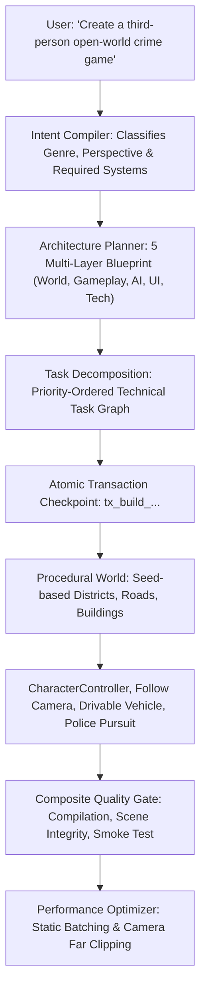

# 🚀 Autonomous AAA Game Build Engine — Unity Architect MCP v4.0.0

The **Autonomous Game Build Engine** (`unity_build_game`) automates the end-to-end transformation of high-level natural language game design visions into running Unity games.

---

## 🔄 End-to-End Orchestration Pipeline

---

## 🛠️ Key Autonomous Tools

- `unity_build_game`: Full end-to-end build runner.
- `unity_generate_game_architecture`: Multi-layer architectural plan generator.
- `unity_decompose_game`: Technical task breakdown engine.
- `unity_compile_intent`: Structured game intent parser.
- `unity_generate_world`: Procedural seed-based city & road network generator.
- `unity_optimize_project`: Automatic static batching & camera optimization.
- `unity_capabilities`: Real-time capability and limitation transparency inspector.
