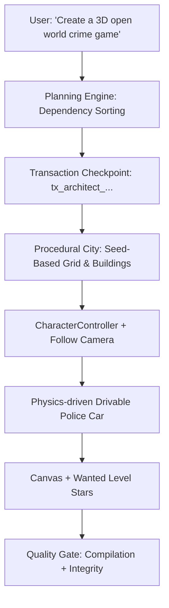

# 🏙️ Game Architect & Procedural Open World Framework

The **Game Architect Engine** provides high-level procedural scaffolding for open-world, 3D action, and simulation prototypes.

---

## 🏗️ Architecture Pipeline

---

## 🎮 Reusable System Patterns

- **Player Controller**: CharacterController movement, sprint, jump, mouse orbit camera.
- **Vehicle System**: 4 WheelColliders, motorTorque, steering angle, center of mass offset.
- **Weapon System**: Raycast shooting, ammo count, reload trigger, particle muzzle flash.
- **Health & Damage**: Event-driven damage, death callback, health regeneration.
- **Wanted & Police**: 5-star wanted level, crime events, AI pursuit trigger.
- **Day/Night Cycle**: Directional light sun rotation and sky ambient interpolation.
- **Traffic System**: Object-pooled vehicle spawner along procedural road paths.
